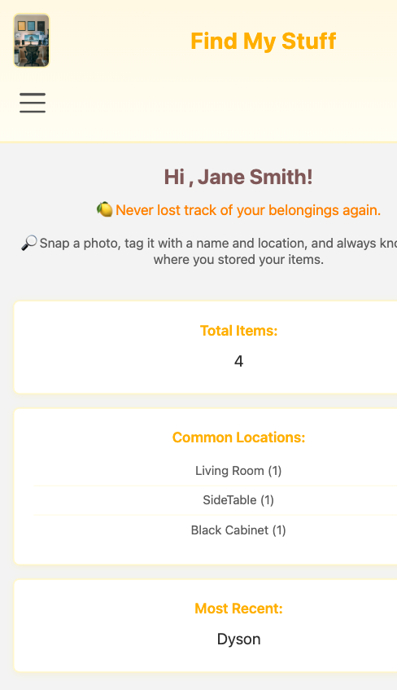
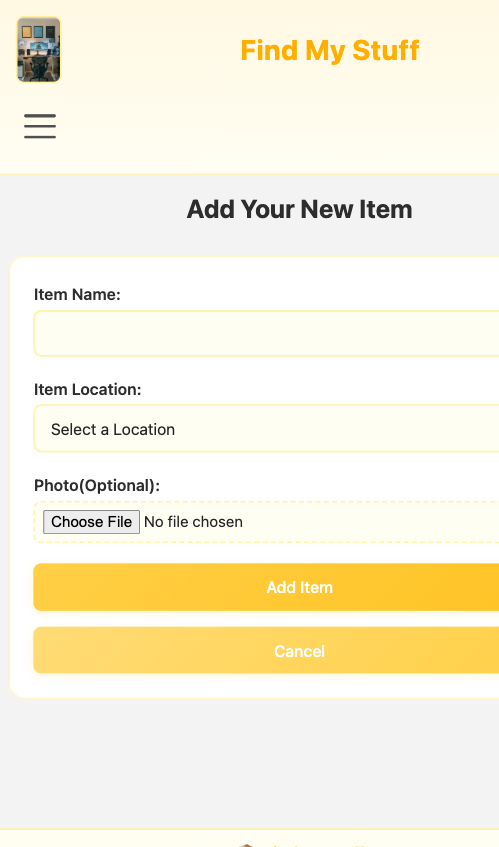
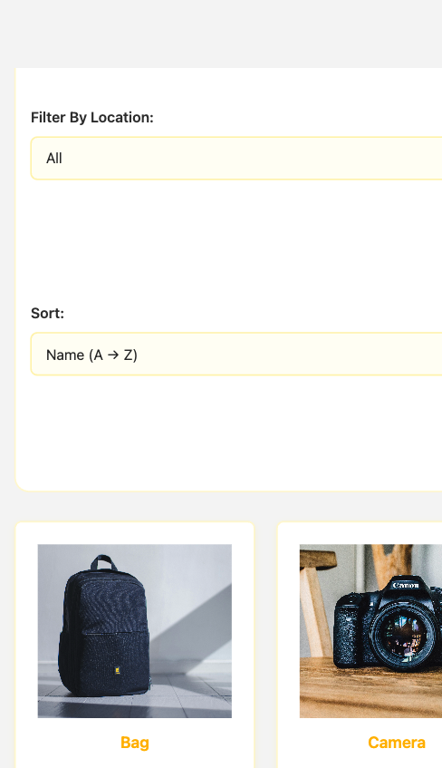
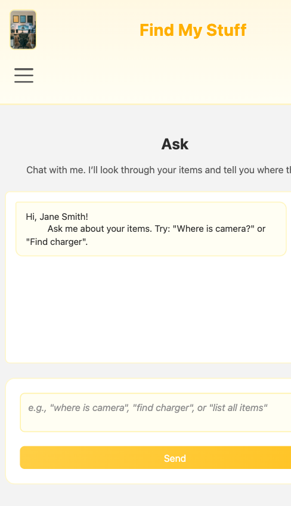

# Find My Stuff

### React · Vite · Component-Driven UI · Accessible Frontend Patterns

Find My Stuff is a React-based single-page application for tracking personal belongings, organizing where they are stored, and quickly searching or asking about them later.

This project was built as the final frontend project for INFO6150 and is the strongest showcase item in this repository. It demonstrates how I moved from static HTML/CSS projects into component-based frontend development with React.

---

## 📌 Overview

The app is designed around a small household-item management workflow:

- save items with names, locations, and optional photos
- browse saved items in a searchable and sortable interface
- view item details in a modal
- ask simple chat-style questions about stored items
- update profile, avatar, password, and theme settings

---

## ✨ Key Features

- **React single-page application flow** with page switching managed in app state
- **Add item workflow** with validation, conditional location input, and image preview
- **Browse experience** with search, location filtering, sorting, and item detail modal
- **Chat-style item lookup** that answers simple natural-language questions from saved item data
- **Profile and settings UI** for editing user information, avatar selection, password updates, and theme switching
- **Accessibility support** including skip links, focus-visible states, keyboard-friendly navigation, and ARIA attributes

---

## 👀 Preview

<table>
  <tr>
    <td align="center"><strong>Home Dashboard</strong><br/><a href="./public/screenshots/home.png"></a></td>
    <td align="center"><strong>Add Item Flow</strong><br/><a href="./public/screenshots/add.png"></a></td>
  </tr>
  <tr>
    <td align="center"><strong>Browse Experience</strong><br/><a href="./public/screenshots/browse.png"></a></td>
    <td align="center"><strong>Ask Interface</strong><br/><a href="./public/screenshots/ask.png"></a></td>
  </tr>
</table>

<p align="center"><sub>Click any preview to open the full-size screenshot.</sub></p>

---

## 🧩 Main Screens

- `Home` — overview cards, common locations, and quick actions
- `Add` — form for creating new tracked items
- `Browse` — searchable and filterable item gallery
- `Ask` — lightweight conversational lookup interface
- `Settings` — profile, avatar, password, and theme controls

---

## 🛠 Tech Stack

- React
- Vite
- JavaScript (ES modules)
- CSS

---

## 🗂 Project Structure

- `src/App.jsx` — top-level app state and page routing logic
- `src/components/` — reusable UI components and page-level views
- `src/styles/` — page and component styling
- `public/` — static images and assets

Key components include:

- `Header.jsx`
- `HomePage.jsx`
- `AddItemPage.jsx`
- `BrowsePage.jsx`
- `AskPage.jsx`
- `SettingsPage.jsx`
- `ItemModal.jsx`

---

## ▶️ Run Locally

```bash
npm install
npm run dev
```

Then open the local Vite URL shown in the terminal, typically:

```text
http://localhost:5173/
```

---

## 💡 Frontend Skills Demonstrated

- component-based UI design in React
- state-driven page rendering
- form validation and conditional fields
- image preview handling with `FileReader`
- searchable/filterable/sortable lists
- modal interaction patterns
- responsive navigation behavior
- accessible labels, focus handling, and skip navigation

---

## 🎯 Project Focus

This project is best understood as a frontend product prototype that combines interface design, user interaction flows, accessibility considerations, and React state management into one cohesive application.
