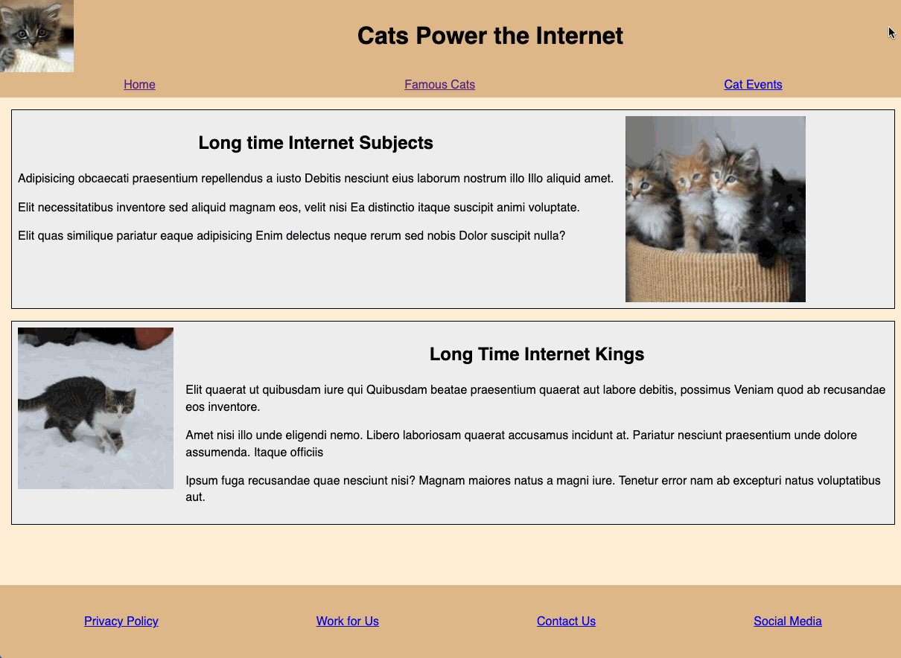
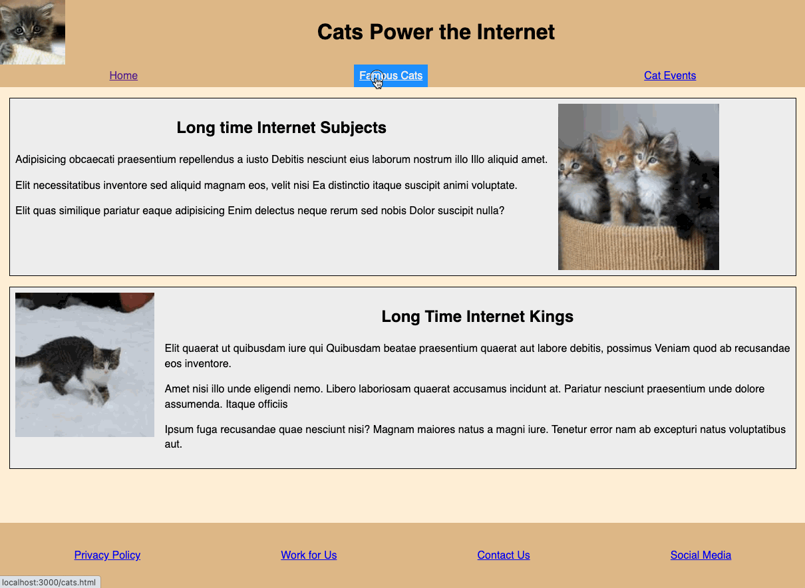

# Project 2: Cats Power the Internet

### Responsive UI · Accessibility · JavaScript Interactions

Cats Power the Internet is an interactive frontend project built with HTML, CSS, and JavaScript. It expands on the first project by adding responsive navigation behavior, modal interaction, keyboard accessibility patterns, and client-side form validation.

---

## 📌 Overview

This project includes:

- a responsive homepage
- a second content page with reusable interaction patterns
- adaptive navigation for desktop and mobile layouts
- a modal subscription flow built with `<dialog>`
- JavaScript-based form validation and submission

---

## 👀 Preview

**Homepage**



**Famous Cats Page**



---

## ✨ Key Frontend Skills Demonstrated

- mobile/desktop adaptive navigation with a hamburger menu
- keyboard-accessible skip link and focus-friendly interactions
- modal interaction using the native `<dialog>` element
- client-side form validation with custom error messaging
- responsive layout changes across breakpoints
- accessible UI behavior using `aria-*` attributes and keyboard support

---

## 🗂 Project Structure

- `public/index.html` — homepage
- `public/cats.html` — second page with modal interactions
- `public/scripts.js` — menu, modal, and validation logic
- `public/styles.css` — adaptive and responsive styling
- `server.js` — static server and subscribe form POST handler

---

## ▶️ Run Locally

```bash
npm install
node server.js
```

Then open:

```text
http://localhost:3000/
```

---

## 🧠 Interaction Highlights

- a single modal can be opened from multiple subscribe actions
- the modal can be closed with the keyboard
- the mobile navigation state responds to viewport resizing
- validation checks both required fields and email confirmation matching

---

## 🎯 Project Focus

This project is best understood as a frontend interaction and accessibility exercise, with emphasis on responsive behavior, progressive enhancement, and JavaScript-driven user interface patterns.
